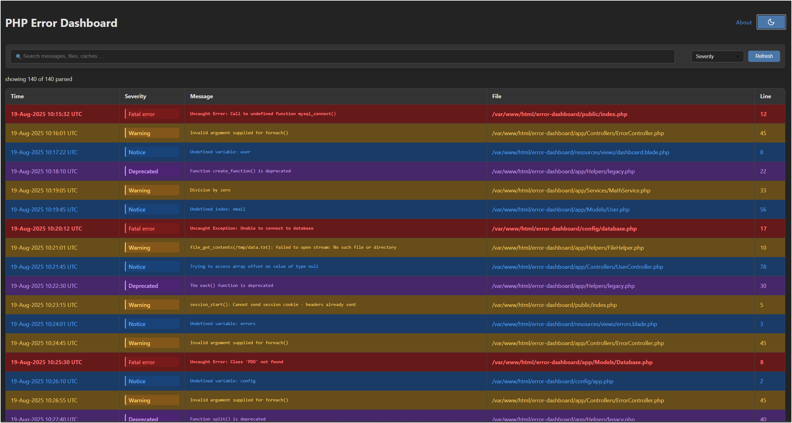

# PHP Error Dashboard



Lightweight tool to parse PHP error logs and inspect results in a modern, responsive web UI.

## Installation

1. Clone the repository:
   ```bash
   git clone https://github.com/abdohwebdev/error-dashboard.git
   cd error-dashboard
   ```

2. No dependencies to install - the project is ready to use.

## Usage

### Parse Error Logs

To run the parser and output JSON data:

```bash
php parse-errors.php
```

### Launch the Dashboard

Serve the application using PHP's built-in web server:

```bash
php -S 127.0.0.1:8000
```

Then navigate to [http://127.0.0.1:8000/index.php](http://127.0.0.1:8000/index.php) in your browser.

### Integration with Existing Projects

To integrate with an existing PHP application:
1. Copy the `parse-errors.php` and `index.php` files to your project directory
2. Modify the error log path in `parse-errors.php` if needed
3. Access the dashboard through your web server

## Features

- Dark/light theme toggle with automatic theme persistence
- Responsive design for all device sizes
- Advanced filtering by error severity and text search
- Click on error messages to search them on Google
- Reset functionality to clear all filters at once
- Severity color coding for better visual identification
- About section with version information and project details

## Technical Details

- **Languages Used**: PHP, HTML, CSS, JavaScript (Vanilla)
- **Backend**: PHP for error log parsing (`parse-errors.php`)
- **Frontend**: Modern responsive UI with CSS variables for theming
- **Data Format**: JSON objects with: `timestamp`, `type`, `message`, `file`, `line`

## Notes

- `parse-errors.php` reads `error.log` and emits structured JSON data.
- For production use with large logs consider adding server-side pagination, indexing (SQLite), or caching.

## Browser Compatibility

- Chrome 80+
- Firefox 72+
- Safari 13+
- Edge 80+
- Opera 67+
- Mobile browsers with modern CSS support

## Performance Considerations

For optimal performance:
- Consider implementing server-side pagination for large log files
- Use SQLite or another database for log indexing with high volumes
- Implement caching mechanisms for frequently accessed data
- Adjust the parsing regex if your error log format differs from standard PHP format

## Contributing

Contributions are welcome and appreciated. Please follow these steps to contribute:

1. Fork the repository
2. Create a feature branch (`git checkout -b feature/amazing-feature`)
3. Commit your changes (`git commit -m 'Add some amazing feature'`)
4. Push to the branch (`git push origin feature/amazing-feature`)
5. Open a Pull Request

## License

This project is licensed under the MIT License - see the [LICENSE](LICENSE) file for details.

## Acknowledgements

- PHP development community
- Open source contributors and testers
- Everyone who has provided feedback and suggestions

---

Developed with ❤️ by [abdohwebdev](https://github.com/abdohwebdev)
